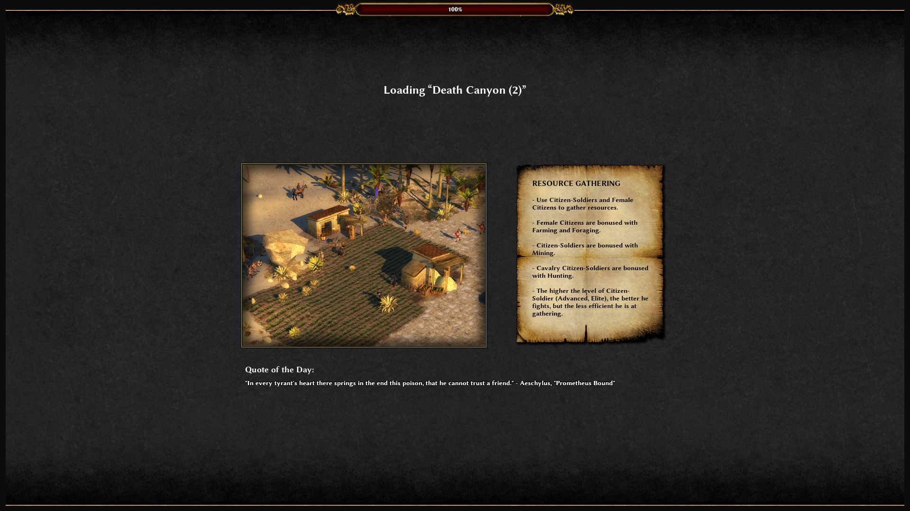

 **Dockerized 0AD**
 
This project was build so I can play  [0AD](https://play0ad.com/). Probably the best linux game

My Fedora 24 crash a few times(0AD was on  alpha stage at the time of this PoC ), so I decided to have some fun with docker and to create a sandbox to play with.
 
Note: In ubuntu image I've installed necessary drivers for Intel HD graphic cards.
You can use [this](http://wiki.ros.org/docker/Tutorials/Hardware%20Acceleration) tutorial  to install other drivers  
 
 
 
**Instructions**

 on host run `sudo xhost +` then
  
 A. Clone this project
  * Build docker file with `docker build -t 0adimage .`
  * Start image with :
  ```
   docker run -it  --rm --privileged --net host \ 
   -v /tmp/.X11-unix:/tmp/.X11-unix -v /run/dbus/:/run/dbus/ \
   -v /dev/shm:/dev/shm --device /dev/snd -e DISPLAY=unix$DISPLAY  \
   -e PULSE_SERVER=tcp:localhost:4713 \
   -e PULSE_COOKIE_DATA=`pax11publish -d | grep --color=never -Po '(?<=^Cookie: ) .*'` \
    --name 0ad 0adimage
  ```
  or 
  
  B. Run the image hosted by dockerhub in [my repository](https://hub.docker.com/u/costache2mihai/)
   ```
  docker run -it  --rm --privileged --net host \ 
   -v /tmp/.X11-unix:/tmp/.X11-unix -v /run/dbus/:/run/dbus/ \
   -v /dev/shm:/dev/shm --device /dev/snd -e DISPLAY=unix$DISPLAY  \
   -e PULSE_SERVER=tcp:localhost:4713 \
   -e PULSE_COOKIE_DATA=`pax11publish -d | grep --color=never -Po '(?<=^Cookie: ) .*'` \
    --name 0ad costache2mihai/0adimage
   ```
   
**Few explanation of the docker run command**
   
 Since 0AD is a GUI application we need to forward X11 from  docker container to host machine so we will need to allow all client to connect to host X11 server with  `sudo xhost +` 
 
 Next we will map local X11 volume `-v /tmp/.X11-unix:/tmp/.X11-unix` an set Display environment `-e DISPLAY=unix$DISPLAY`
 
 We also want audio so we will use below attributes (Thanks to great explanation by **_lidel_**  [here](https://github.com/jessfraz/dockerfiles/issues/85))
 ```
 -e PULSE_SERVER=tcp:localhost:4713 \
 -e PULSE_COOKIE_DATA=`pax11publish -d | grep --color=never -Po '(?<=^Cookie: ) .*'` \
 ```
 
 That's all, should work, for me it does :smile:
 
 

 
 
 
 
 